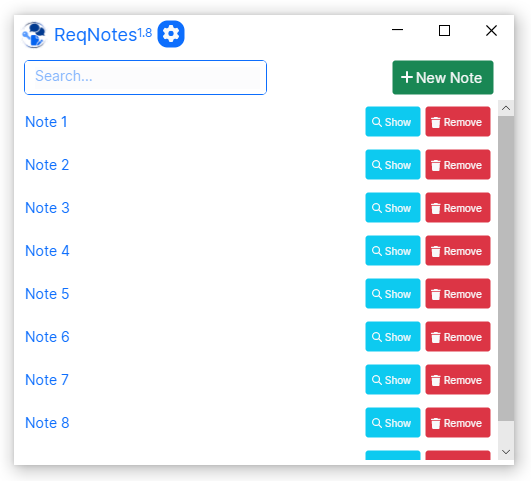

<a name="readme-top"></a>

<!-- PROJECT LOGO -->
<br />
<div align="center">
  <a href="https://github.com/ReqBaa/ReqNotes">
    
  </a>

  <h3 align="center">ReqNotes</h3>

  <p align="center">
    Personal Notes Application
    <br />
        <a href="#installation"><strong>Download and Install »</strong></a>
    <br />
    <br />
    <a href="https://github.com/ReqBaa/ReqNotes/issues">Report Bug</a>
    ·
    <a href="https://github.com/ReqBaa/ReqNotes/issues">Request Feature</a>
  </p>
</div>


   [](https://www.gnu.org/licenses/gpl-3.0)

<!-- ABOUT THE PROJECT -->
## About The Project



ReqNotes:
* Take note.

<p align="right">(<a href="#readme-top">back to top</a>)</p>

## Installation
<a name="installation"></a>

### Minimum Requirements

* _Windows:_
  * Windows 10 or later.
* _Linux:_
  * Ubuntu 18.04 or later.

### Download & Install

_Windows:_
* Download the latest version and Install:

  * x64 (v1.7): [Download](https://github.com/ReqBaa/ReqNotes/releases/download/v1.7/reqnotessetup-x64-1.7.exe)

  * x86 (v1.7): [Download](https://github.com/ReqBaa/ReqNotes/releases/download/v1.7/reqnotessetup-x86-1.7.exe)

_Linux:_
- Download and Install deb:
  - amd64 (v1.7): [Download](https://github.com/ReqBaa/repo/raw/33d80f78a776e165f8caede21a8ed697468bf451/pool/main/r/reqnotes/reqnotes_1.7-0ubuntu1_amd64.deb)
- or Install with apt:
  - Open terminal:
  ```sh
  wget -qO - https://raw.githubusercontent.com/ReqBaa/repo/master/PUBLIC.KEY | gpg --dearmor | sudo tee /etc/apt/trusted.gpg.d/reqbaa.key >/dev/null
  echo "deb [signed-by=/etc/apt/trusted.gpg.d/reqbaa.key] https://raw.githubusercontent.com/ReqBaa/repo/master/ bionic main" | sudo tee /etc/apt/sources.list.d/reqbaa.list >/dev/null
  sudo apt-get update
  sudo apt-get install reqnotes
  ```

<p align="right">(<a href="#readme-top">back to top</a>)</p>

### Built With

* 
* 

<p align="right">(<a href="#readme-top">back to top</a>)</p>

<!-- CONTRIBUTING -->
## Contributing

Any contributions you make are **greatly appreciated**.
* If you have suggestions for adding or removing projects, feel free to [open an issue](https://github.com/ReqBaa/ReqNotes/issues/new) to discuss it.
* Please make sure you check your spelling and grammar.
* Create individual PR for each suggestion.

<p align="right">(<a href="#readme-top">back to top</a>)</p>

<!-- LICENSE -->
## License

Distributed under the GNU GENERAL PUBLIC LICENSE Version 3 License. See `LICENSE` for more information.

<p align="right">(<a href="#readme-top">back to top</a>)</p>

<!-- CONTACT -->
## Contact

Project Link: [https://github.com/ReqBaa/ReqNotes](https://github.com/ReqBaa/ReqNotes)

<p align="right">(<a href="#readme-top">back to top</a>)</p>

<!-- ACKNOWLEDGMENTS -->
## Acknowledgments

* 
* 
* 

<p align="right">(<a href="#readme-top">back to top</a>)</p>
